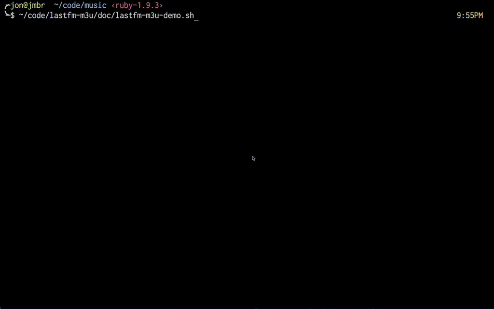

# Lastfm Top tracks Playlist creator

Searches given directory for mp3/flac files that match lastfm top tracks for given artist.

## Installation

    $ gem install lastfm-m3u
    $ lastfm-m3u --init
    Follow instructions to add your Lastfm API keys

## Usage

    LastfmM3u Playlist Creator
    To get started: lastfm-m3u --init
    
    Usage: lastfm-m3u [options]
    Note: defaults to filename-only search. id3/both search is more thorough, but much slower
    
    Examples:
      lastfm-m3u -a "Biosphere,Brian Eno"
      lastfm-m3u -a Biosphere
      lastfm-m3u -a Biosphere -t both
      lastfm-m3u -a Biosphere -d ~/music/Biosphere
    
    
    Options:
        -t, --type TYPE                  Select search type
                                           (f,i,b,file,id3,both)
        -i, --init                       init lastfm API access config
        -a "x,y,z"                       one or more artists separated by commas (enclose with quotes if any spaces)
        -d, --directory DIR              music directory
        -p, --path PATH                  Specify path to use for m3u file entries (e.g. MPD requires a path relative to its music directory - i.e. -d /home/user/music/Biosphere -p /home/user/music where the second one is MPD's root)
        -l, --limit NUM                  Specify limit of tracks to fetch from Last.fm (defaults to all)
        -f, --not-found                  Show not found
            --debug [LEVEL]              Enable debugging output (Optional Level :: 0=all, 1=info,warn,error, 2=warn,error, 3=error)
        -v, --version                    Show LastfmM3u version
        -h, --help                       Show this help message

## Demo

